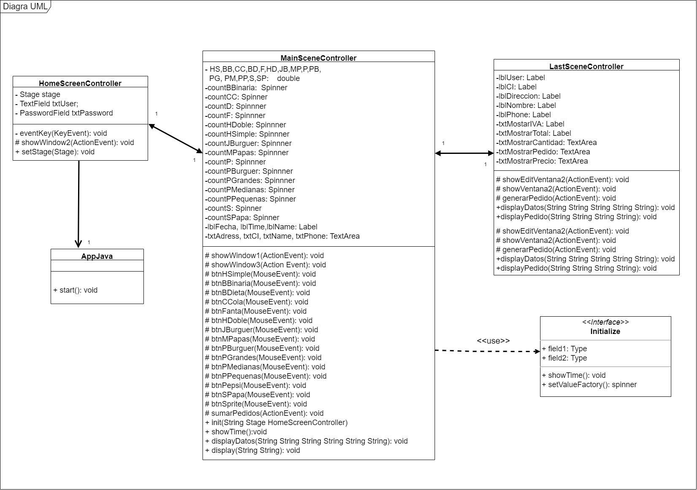

# PROYECTO: PROGRABURGUERS

Proyecto de Programacion del Segundo Bimestre

## *Integrantes*

* Elian Gavilanes
* Sebastian Roblez
* Jorge Rojas

## El *workspace* contiene lo siguiente

* `src`: la carpeta que contiene toda la progrmación del proyecto

1. `controller`: esta subcarpeta se encuntran los controladores de las pantallas

2. `view`: esta subcarpeta contiene los archivos FXML de las ventanas y las img

* `lib`: la libreria usada en este proyecto fue `JavaFX`, además para la creación del pdf se uso la libreria `iText 5`.

___
> `IMPORTANTE:`Para el uso del programa es necesario modificar el *json* de la siguiente manera:

``` json
"vmArgs": "--module-path \"C:/Java/javafx-sdk-18.0.1/lib\" --add-modules javafx.controls,javafx.fxml"
```

___

### Link GITHUB

>El `PROYECTO` se lo puede encontrar en el siguiente link del github [aquí](https://github.com/elian18/FirstJavaFXProject.git "FirstJavaFXProject").
___
A continuación se presenta ejemplo de código y diagrama de clases

#### Ejemplo de codigo

``` java
        String usuario = txtUser.getText();
        FXMLLoader loader = new FXMLLoader(getClass().getResource("/view/Window2.fxml"));
        Parent root = loader.load();
        MainSceneController controller = loader.getController();
        Scene scene = new Scene(root);
        Stage stage = new Stage(); // Crea la ventana
        stage.setScene(scene);
        controller.init(usuario, stage, this);
        stage.show();
        this.stage.close();
```

#### Diagrama de Clases


