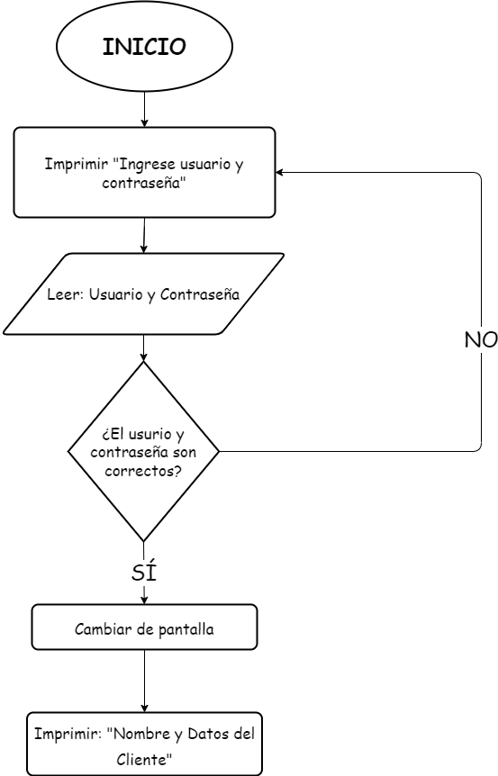

# PROYECTO: PROGRABURGUERS

Este es el proyecto de 1er Bimestre de Programación: II

## *Integrantes*

* Elian Gavilanes
* Sebastian Roblez
* Jorge Rojas

## El *workspace* contiene lo siguiente

* `src`: la carpeta que contiene toda la progrmación del proyecto
* `lib`: la libreria usada en este proyecto fue JavaFX

### Link GITHUB

>El `PROYECTO` se lo puede encontrar en el siguiente link del github [aquí](https://github.com/elian18/FirstJavaFXProject.git "FirstJavaFXProject").
___
A continuación se presenta ejemplo de código y diagrama de flujo

#### Ejemplo de codigo

``` java
FXMLLoader loader = new FXMLLoader(getClass().getResource("/view/Window1.fxml"));
        Parent root = loader.load();
        Scene scene = new Scene(root);
        primaryStage.setScene(scene);
        HomeScreenController controller = loader.getController();
        controller.setStage(primaryStage);
        primaryStage.show();
```

#### Diagrama de Flujo


